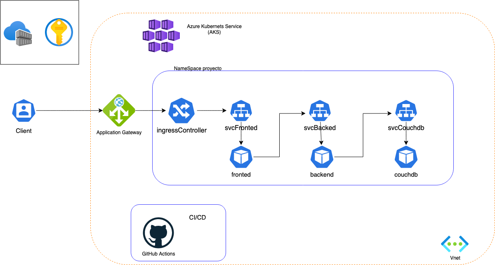
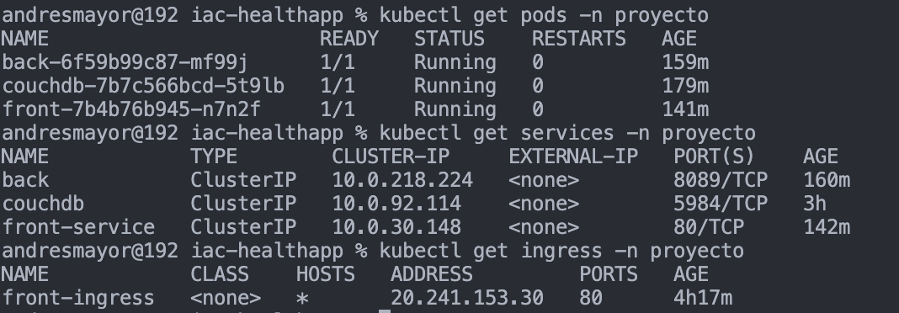
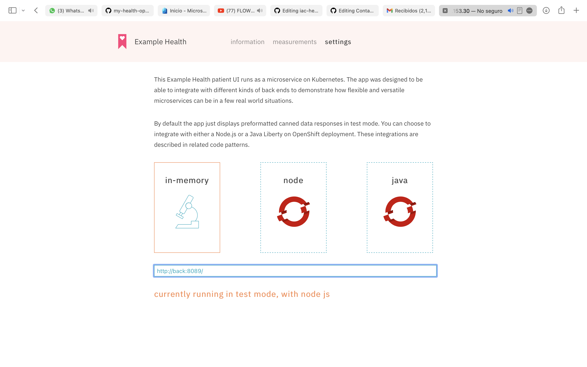
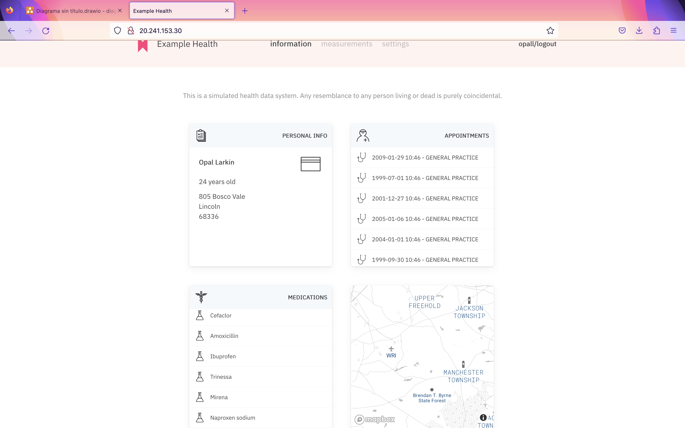

# iac-healthapp

## Diagrama Provisioning IaC

  

1. Linea de comandos para deplegar la infraestructura 
  
   terraform init
   terraform apply

# Comandos para configurar y desplegar los pods y el ingress en el aks 

1 Enlazamos el azure container registry con el aks

      az aks update -n myAKSCluster -g myResourceGroup --attach-acr <acr-name>

3. Creamos rol y secreto de docker en el aks. Con el fin de que el aks pueda descargar las imagenes.

      az ad sp create-for-rbac --name {SERVICE_PRINCIPAL_NAME} --role Reader --scopes $ACR_REGISTRY_ID
      
      kubectl create secret docker-registry acr-secret --docker-server={ACR_NAME}.azurecr.io --docker-username={APP_ID} --docker-              password={PASSWORD}

4. Nos conectamos al aks y ejecumtamos los manifiestos en el siguiente orden 

      cd k8s
      cd namespaces
      kubectl apply -f ns-proyecto.yml
      cd ..
      cd ingress
      kubectl apply -f ingress.yml
      cd ..
      cd pods
      kubectl apply -f front.yml
      kubectl apply -f database.yml
      kubectl apply -f back.yml

# Estado de la configuración del aks

  

# Conectamos el Front con el back

  
  
# Ingresamos y validamos funcionamiento

  

      

